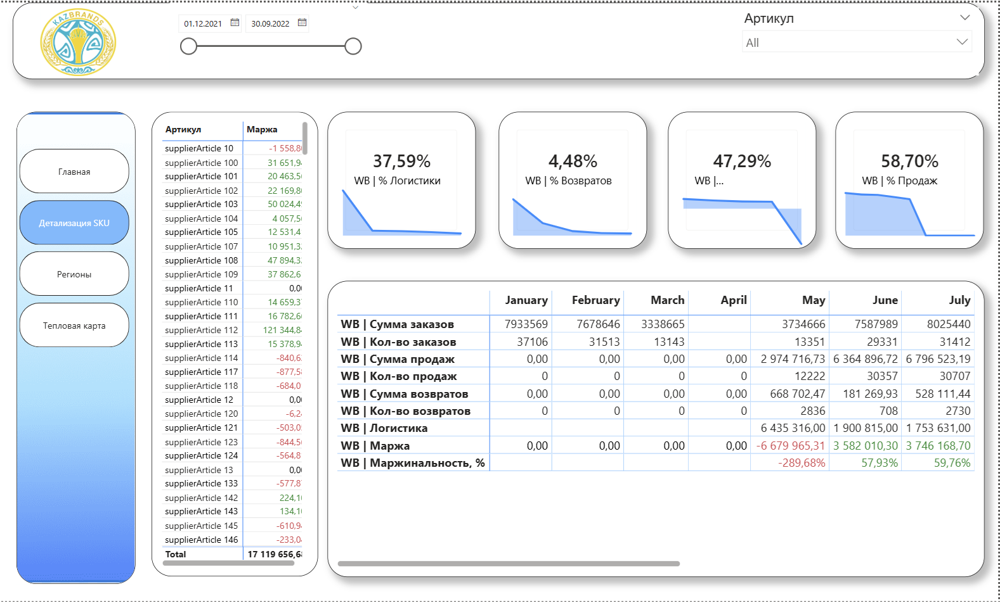

# Wildberries-Sales-Analytics-Power-BI-Dashboard
This project is a Power BI analytical dashboard developed to analyze sales performance of an e-commerce business (Wildberries marketplace).  The main goal of the project was to transform raw sales data into clear, actionable insights that support business decision-making.

🎯 Project Goals

- Analyze revenue, profit, and profitability
- Track logistics costs and returns
- Evaluate sales performance by SKU
- Analyze regional and warehouse performance
- Identify seasonality and demand patterns
- Provide clear insights for business decision-making

🏠 Main Dashboard

Overview of key business metrics:
- Revenue
- Margin
- Margin %
- Number of orders
- Returns
- Sales dynamics

📦 SKU Details

Detailed product-level analytics:
- Revenue by SKU
- Number of orders
- Profitability
- SKU comparison

🌍 Regions

Geographical and warehouse analysis:
- Sales by region
- Share of total sales
- Warehouse performance

🔥 Heatmap (Seasonality)

Time-based analysis:
- Orders by day of week
- Orders by day of month
- Month × Day heatmap
- Identification of peak periods

🧠 Key Implementations

- Built a star schema data model
- Cleaned and transformed raw data
- Created calculated measures using DAX
- Implemented interactive filters and slicers
- Designed a user-friendly dashboard layout
- Applied business logic for KPI calculations

🚀 Project Purpose

This project demonstrates:
- Practical Power BI skills
- Understanding of e-commerce analytics
- Ability to build clean and scalable dashboards
- Strong data modeling approach
- Attention to UX and business logic
